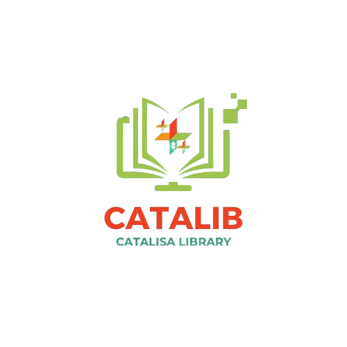

<div align="center">
  
</div>

# ☕📚 Documento de Requisitos para o Sistema CataLib
## 🌟 Visão Geral do Projeto
### 📝 Descrição do Sistema
O sistema CRUD de biblioteca é uma aplicação simples que permite gerenciar o acervo de uma biblioteca. Ele possibilita a criação, leitura, atualização e exclusão de registros de livros, além de funcionalidades adicionais como busca, filtros e ordenação.
### 🎯 Objetivo Principal
Gerenciar o acervo de livros.
### 👥 Público-Alvo
- 📖 Bibliotecários e administradores responsáveis pelo gerenciamento do acervo.
- 🔍 Usuários finais que desejam consultar informações sobre os livros disponíveis.
## ✅ Requisitos Funcionais
### ⚙️ Funcionalidades Principais
1. **🆕 Criar Livro**: Permitir o cadastro de novos livros no sistema.
2. **📄 Ler Livro**: Exibir a lista de livros cadastrados e detalhes de um livro específico.
3. **✏️ Atualizar Livro**: Permitir a edição das informações de um livro existente.
4. **🗑️ Deletar Livro**: Permitir a exclusão de livros do sistema.
### 📋 Campos Necessários para Cada Livro
- **📚 Título** (obrigatório)
- **✍️ Autor** (obrigatório)
- **📂 Gênero** (obrigatório)
- **📅 Data de Publicação** (obrigatório)
- **🔢 Número de Exemplares** (obrigatório)
### 🔧 Funcionalidades Adicionais
1. **🔍 Busca**: Permitir a busca de livros por título ou autor.
2. **📑 Filtros**: Filtrar livros por gênero. (Opcional)
## 🏁 Critérios de Aceitação
1. ✅ O sistema deve permitir a criação de um novo livro com todos os campos obrigatórios preenchidos.
2. ❌ O sistema deve exibir uma mensagem de erro caso o usuário tente excluir um livro inexistente.
3. 🔍 A busca deve retornar resultados relevantes com base no título ou autor.
## 🚀 Como Rodar o Sistema
### Pré-requisitos
- 🖥️ Ter o [Java JDK](https://www.oracle.com/java/technologies/javase-downloads.html) instalado.
- 📦 Instalar o Maven para gerenciar as dependências.
- 🛠️ Configurar um banco de dados (ex.: MySQL, PostgreSQL).
### Passos
1. Clone o repositório:
```bash
git clone https://github.com/seu-usuario/catalib.git
```
2. Navegue até o diretório do projeto:
```bash
cd catalib
```
3. Compile o projeto:
```bash
mvn clean install
```
4. Execute o sistema:
```bash
java -jar target/catalib.jar
```
## 🌐 Exemplos de Uso da API
### Endpoints Disponíveis
- **POST /books**: Criar um novo livro.
- **GET /books**: Listar todos os livros.
- **GET /books/{id}**: Obter detalhes de um livro específico.
- **PUT /books/{id}**: Atualizar informações de um livro.
- **DELETE /books/{id}**: Excluir um livro.
### Exemplos de Requisições
#### Criar um Livro
```bash
curl -X POST http://localhost:8080/books \
-H "Content-Type: application/json" \
-d '{
"title": "O Senhor dos Anéis",
"author": "J.R.R. Tolkien",
"genre": "Fantasia",
"publicationDate": "1954-07-29",
"copies": 5
}'
```
#### Listar Livros
```bash
curl -X GET http://localhost:8080/books
```
#### Atualizar um Livro
```bash
curl -X PUT http://localhost:8080/books/1 \
-H "Content-Type: application/json" \
-d '{
"title": "O Hobbit",
"author": "J.R.R. Tolkien",
"genre": "Fantasia",
"publicationDate": "1937-09-21",
"copies": 3
}'
```
#### Excluir um Livro
```bash
curl -X DELETE http://localhost:8080/books/1
```
## 📅 Cronograma e Priorização
### ⏳ Estimativa de Tempo
1. **🚀 MVP (Funcionalidades Básicas)**:
- CRUD de livros: 2 horas
2. **✨ Funcionalidades Adicionais**:
- Busca e filtros: Próximos passos.
### 📌 Priorização
1. 🥇 MVP com funcionalidades básicas (CRUD e autenticação).
2. 🥈 Funcionalidades adicionais (busca, filtros e ordenação).
💻 Feito com ☕ e Java por:
- Alessandra Domiciano Soares Silva
- Flavia Garcias Hespanhol
- Luiz Vinicius Ramos Silva
- Matheus de Souza Pereira dos Santos
- Núbia Barcellar Moreira
- Rodolffo Nivass Moreira e Souza
